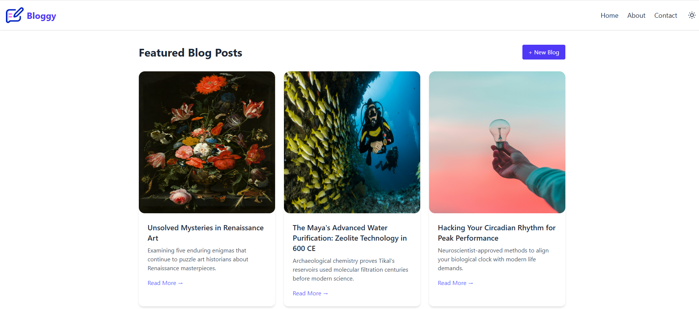
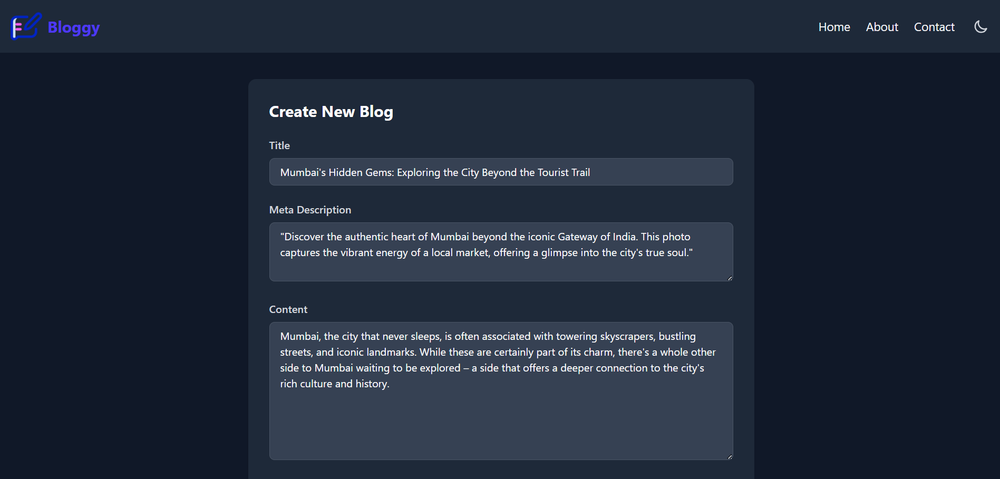

# 📝 Blog Web App

A responsive full-stack blog web application built with **Express.js**, **EJS**, **Tailwind CSS**, and **Multer** for image uploads. Users can create, read, and manage blog posts with featured images.

## 🚀 Live Demo

👉 [View Deployed App](https://blog-web-app-pqjy.onrender.com)

## 📸 Features

- 📄 Create new blog posts with title, meta description, content, and image
- 🖼 Upload featured images (using `Multer`)
- 🧵 Full post detail view via "Read More"
- 📩 Contact form with thank you message
- 🌙 Dark mode support (via Tailwind)
- 📱 Fully responsive UI
- ⚙️ Clean folder structure with partials for header/footer
- 🌐 Deployed on [Render](https://render.com)

---
## 📸 Screenshots
### 🏠 Home Page

|  | .png) |
|-------------------------------------|-------------------------------------|
| Home layout with light mode         | Home layout with dark mode          |

### 📝 Create Post

|  | .png) |
|----------------------------------------------|----------------------------------------------|
| Blog form page                               | Upload file and preview                          |

### 📖 Read Full Article

|  |
|------------------------------------------|
| Read full blog content                   |

---
## 🛠️ Tech Stack

| Technology     | Description                      |
|----------------|----------------------------------|
| Node.js + Express | Backend server logic           |
| EJS            | Server-side templating           |
| Tailwind CSS   | Styling framework                |
| Multer         | File/image uploads               |
| UUID           | Unique post identifiers          |
| Render         | Deployment platform              |
| Git + GitHub   | Version control                  |
